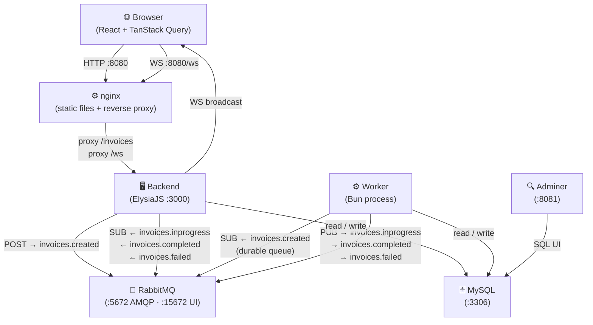
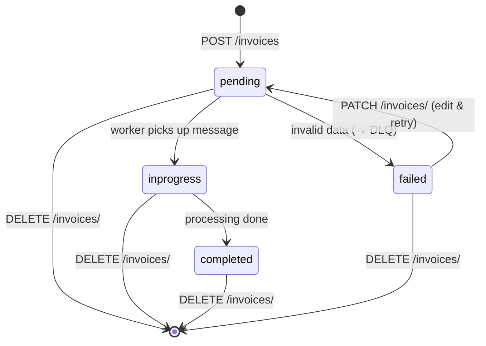

# Distributed Systems — Invoice Processing

A monorepo demonstrating distributed systems concepts through an invoice processing pipeline. Invoices are created via a REST API, queued in RabbitMQ, processed asynchronously by a worker, and status changes are pushed to the browser in real time over WebSocket.

## Architecture



### Invoice lifecycle



### Message topology (RabbitMQ)

| Exchange              | Type   | Consumer | Queue                               |
| --------------------- | ------ | -------- | ----------------------------------- |
| `invoices.created`    | fanout | worker   | `worker.invoices.created` (durable) |
| `invoices.inprogress` | fanout | backend  | exclusive + autoDelete              |
| `invoices.completed`  | fanout | backend  | exclusive + autoDelete              |
| `invoices.failed`     | fanout | backend  | exclusive + autoDelete              |
| `invoices.dlx`        | direct | —        | `invoices.dead-letter` (DLQ)        |

Failed messages (handler throws) are routed to the DLQ via `x-dead-letter-exchange`.

---

## Stack

| Layer           | Technology                                  |
| --------------- | ------------------------------------------- |
| Frontend        | React 19, TanStack Query, TailwindCSS, Vite |
| Backend         | ElysiaJS, Bun                               |
| Worker          | Bun (pure RabbitMQ consumer)                |
| Messaging       | RabbitMQ 3 (AMQP)                           |
| Database        | MySQL 8, Prisma ORM                         |
| Package manager | Bun 1.3.6 workspaces                        |

### Workspace packages

| Package             | Description                                                          |
| ------------------- | -------------------------------------------------------------------- |
| `packages/shared`   | Domain types, constants, `InvoiceStatus`, `InvoiceExchanges`         |
| `packages/database` | Prisma schema, generated client, migrations                          |
| `packages/rabbitmq` | `publish()`, `subscribe()`, `subscribeWork()`, connection management |

---

## Getting started

### Prerequisites

- [Bun](https://bun.sh) >= 1.3.6
- [Docker](https://www.docker.com) + Docker Compose

### Run with Docker (recommended)

```bash
# Build and start all services
docker compose up --build

# Rebuild a single service
docker compose up --build --no-deps backend
docker compose up --build --no-deps worker
docker compose up --build --no-deps frontend
```

| Service      | URL                                                                                 |
| ------------ | ----------------------------------------------------------------------------------- |
| Frontend     | http://localhost:8080                                                               |
| Backend API  | http://localhost:3000                                                               |
| RabbitMQ UI  | http://localhost:15672 (guest / guest)                                              |
| Adminer (DB) | http://localhost:8081 (server: `mysql`, user: `root`, pass: `root`, db: `invoices`) |

### Run locally (dev mode)

Requires RabbitMQ and MySQL running (e.g. via Docker):

```bash
# Start infrastructure only
docker compose up rabbitmq mysql adminer

# Install dependencies
bun install

# Generate Prisma client and push schema
bun run db:generate
bun run db:push

# Start all apps in watch mode (separate terminals)
bun run --filter '@distributed-systems/backend' dev
bun run --filter '@distributed-systems/worker' dev
bun run --filter '@distributed-systems/frontend' dev
```

---

## Scripts

### Root (run from monorepo root)

```bash
bun run dev          # Start all apps in watch mode
bun run test         # Run all test suites
bun run typecheck    # TypeScript check across all packages
bun run lint         # ESLint
bun run lint:fix     # ESLint with auto-fix
bun run format       # Prettier write
bun run format:check # Prettier check
bun run knip         # Dead code / unused exports check
```

### Database

```bash
bun run db:generate          # Generate Prisma client
bun run db:push              # Push schema to DB (no migration file, dev only)
bun run db:migrate           # Create a new migration (interactive, prompts for name)
```

### Per-app

```bash
bun run --filter '@distributed-systems/backend'  dev
bun run --filter '@distributed-systems/worker'   dev
bun run --filter '@distributed-systems/frontend' dev
bun run --filter '@distributed-systems/backend'  test
bun run --filter '@distributed-systems/frontend' test
bun run --filter '@distributed-systems/backend'  typecheck
```

### Docker

```bash
docker compose up --build              # Full rebuild + start
docker compose up --build --no-deps frontend   # Rebuild frontend only
docker compose up --build --no-deps backend    # Rebuild backend only
docker compose up --build --no-deps worker     # Rebuild worker only
docker compose logs -f backend worker  # Follow logs for backend + worker
docker compose down                    # Stop all containers
docker compose down -v                 # Stop + remove volumes (fresh DB)
```

---

## Project structure

```
distributed-systems/
├── apps/
│   ├── backend/          # ElysiaJS REST API + WebSocket server
│   │   └── src/modules/invoicing/
│   │       ├── application/commands/   # create-invoice, retry-invoice, delete-invoice
│   │       ├── application/queries/    # list-invoices
│   │       ├── domain/                 # repository interface, errors
│   │       ├── infrastructure/         # Prisma repo, RabbitMQ consumers
│   │       └── presentation/http/      # Elysia routes, WS handler
│   ├── worker/           # Background invoice processor
│   │   └── src/modules/invoicing/
│   │       ├── application/commands/   # process-invoice handler
│   │       └── infrastructure/         # RabbitMQ consumer + publisher
│   └── frontend/         # React SPA
│       └── src/features/invoice/
│           ├── generate-invoice-form/
│           └── invoice-list/
├── packages/
│   ├── shared/           # Domain types shared across all apps
│   ├── database/         # Prisma schema + client
│   └── rabbitmq/         # AMQP connection, publish, subscribe, subscribeWork
└── docker-compose.yml
```
